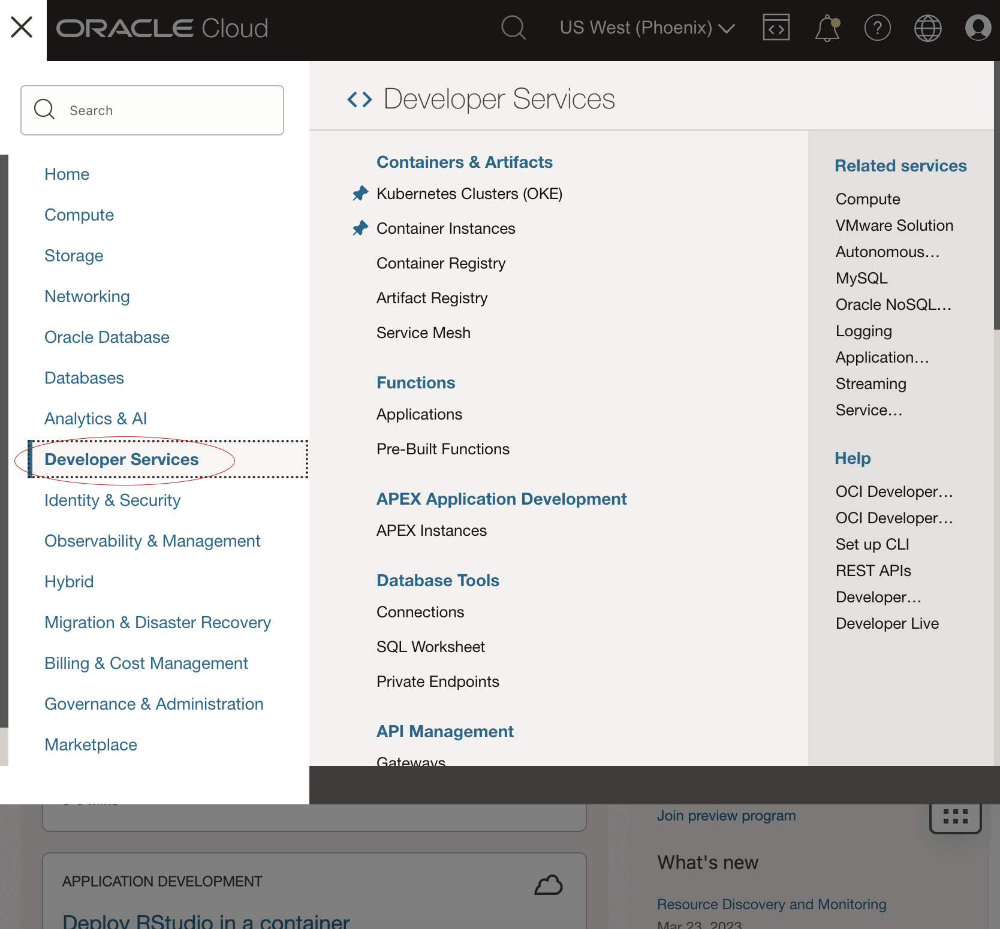
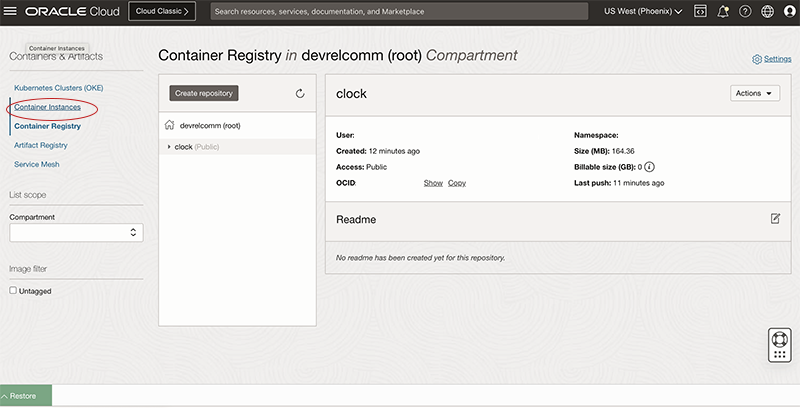
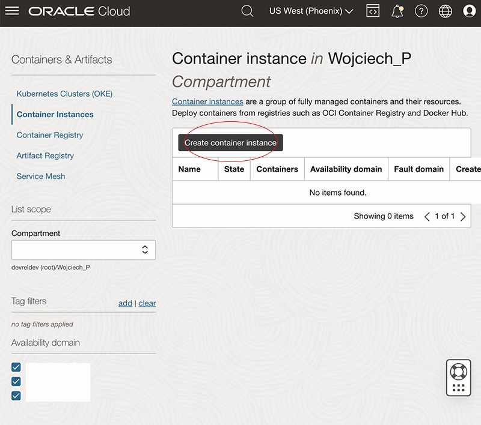
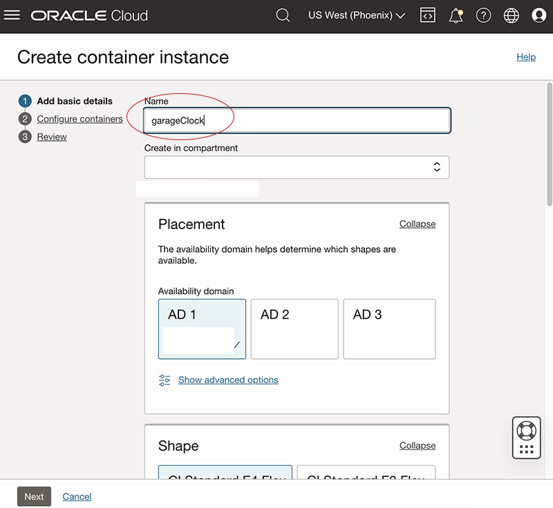
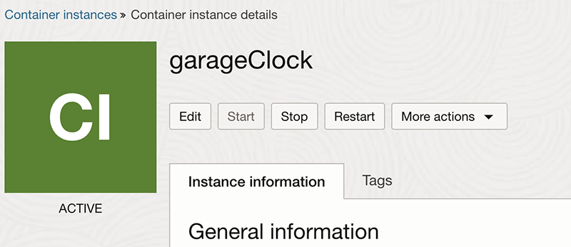

# oci-jet-garage-clock

 

## Introduction
Using Preact and the Oracle JavaScript Extension Toolkit (JET), learn how to build and deploy the same application used by the Oracle Red Bull Racing team to manage their race schedule and event timing.  You will learn about JavaScript date/time API usage, manipulation of list based data, and the browsers localStorage API for offline features all in a standalone client-side application.  You will also learn how to deploy the application to the Oracle Cloud Infrastructure(OCI) using Docker, so that the application is readily available from anywhere in the world.

## Getting Started - Deploy Oracle JET app to the Container Instances
### Compile and push your image  
- Login to your account on cloud.oracle.com  
- Open Cloud Shell  
- Clone this repository with following command (TODO)  
        `git clone -b CI https://github.com/WSPluta/f1countDownTimer.git`
- Open your freshly cloned repository:  
        `cd garageClock`  
- Create docker container:   
        `docker build -t clock .`  
- Generate auth token:  
        `oci iam auth-token create --description "DEFAULT" --user-id <paste user OCID> --query 'data.token' --raw-output`  
- Echo your _namespace_:  
        `oci os ns get -c $OCI_TENANCY --query 'data' --raw-output`  
- Login to your container registry - replace with xxx with your region  
        `docker login <paste yoy region>.ocir.io`  
- Input your details  
        Username:   
        Password: `<paste auth token>`
- Tag your container:  
        `docker tag clock:latest <paste yoy region>.ocir.io/<paste namespace>/clock:latest`  
- Push your image to the Container Registry:  
        `docker push <paste yoy region>.ocir.io/<paste namespace>/clock:latest`

### Deploy Container Instance
We will deploy our app using UI, but you can do with Cloud Shell too.
- Click on _hamburger menu_   
          
- Click on _Developer Services_
          
- Click on _Container Instances_
          
- Click on _Create container instance_
          
- Add _Name_, choose _Compartment_, _Availability domain_, _Shape_, _Virtual cloud network_ and _Subnet_ ( we need to have TCP port 80 opened )
          
- Click _Next_
- In Image section click on _Select image_
          
- Click on _Choose repository_ and select your container - if you cant find you image try changing the compartment to root
- Pick _Image in repository_, in our case it is latest since this is how we tagged it in our docker push command
          
- Click on _Select image_
- Click _Next_
- Check your settings and click _Create_
- Wait for your app to deploy
- Once ready you can copy and paste public IP in your browser and voila your Container Instance is up and running
          

### Prerequisites
General knowledge of docker and networking

## Notes
### Installing local for development 
1. For Development use homebrew or similar package manager to install Oracle JET `brew install --cask jet`
1. Install Nodejs (latest LTS release would be recommended) From a terminal or command line window.
2. Globally install http-server NPM module.  `npm -g install http-server`
3. Unzip the countdown app into some empty folder
4. From the root of that countdown app folder, `run http-server -o`  (that's a lower case o, not zero)

### Run app for local development
1. From root folder run `ojet restore` to install environment
2. To start app run `ojet serve`

### Packaging for distribution
3. To distribute app run `ojet build --release`

#### ojet restore help
	Command details:

    restore .............................. Restores missing dependencies, plugins, and libraries to a JET app

         [app] ........................... Restores missing dependencies, plugins, and libraries to a JET app

            --secure ..................... Whether to enforce secure HTTPS protocol
                                           Value: [true|false]
                                           Default: true
            --username | u ............... The user's registered username
            --password | p ............... The user's registered password
            --ci ......................... Use npm ci instead of npm install
                                           Default: false

Examples:

    ojet restore
    ojet restore app

#### ojet serve synopsis:

    ojet serve [<scope>] [<parameter>] [<options>]

Command details:

    serve | s ............................ Serves a JET app to an emulator, device or the browser

         [app] ........................... Serves a JET app for the specified platform
                                           Parameter: [android|ios|windows|web]

            --release | r ................ Serve in release mode
                                           Value: [true|false]
            --optimize ................... Specify rjs optimize value
                                           Value: <string>
            --build-config ............... Specify the build config file for signing the hybrid app
                                           Value: <build_config_file>
            --build ...................... Build the app before serving it
                                           Value: [true|false](--no-build)
                                           Default: true
            --sass ....................... Enable SASS compilation and SASS watch 
                                           Value: [true|false](--no-sass)
                                           Default: true
            --server-port ................ Specify the server port
                                           Value: <integer>
                                           Default: 8000
            --svg ........................ Enable SVG re-compilation for JET Alta Theme
                                           Value: [true|false]
                                           Default: false
            --theme ...................... Specify the theme to be used by the app,
                                           -> alta themes are platform specific
                                           -> redwood theme is for all platforms
                                           Value: <theme_name>[:<platform>]

#### ojet build synopsis:

    ojet build [<scope>] [<parameter>] [<options>]

Command details:

    build | b ............................ Builds a JET app

         [app] ........................... Builds a JET app for the specified platform,
                                           where [app] is the directory context of the JET app.
                                           
                                           Parameter: [android|ios|windows|web] - specifies the build platform
                                           The default platform is 'web'

            --release | r ................ Build in release mode
                                           Value: [true|false]
            --optimize ................... Specify rjs optimize value
                                           Value: <string>
            --build-config ............... Specify the build config file for signing the hybrid app
                                           Value: <build_config_file>
            --sass ....................... Enable SASS compilation
                                           Value: [true|false](--no-sass)
                                           Default: true
            --svg ........................ Enable SVG re-compilation for JET Alta Theme
                                           Value: [true|false]
                                           Default: false
            --theme ...................... Specify the theme to be used by the app,
                                           -> alta themes are platform specific
                                           -> redwood theme is for all platforms
                                           Value: <theme_name>[:<platform>]
                                           where <theme_name> is: alta or <custom_theme_name>
                                           and <platform> is one of: android, ios, web, windows
                                           Default: redwood for web platform
            --themes ..................... Specify multiple themes separated by comma(s)
                                           When the --theme flag is missing,
                                           the first element in the --themes flag is identified as the default theme.
            --cssvars .................... Specify to inject css file which supports css custom properties
                                           When the --cssvars flag is missing,
                                           the default css preprocessor has been used to process away the custom properties.
                                           Value: [enabled|disabled]
                                           Default: disabled
            --user-options ............... Specify user-defined options - these are accessible in hooks config object
                                           Value: <string>

            Hybrid only:

            --destination ................ Specify the destination for building the app
                                           Value: device|emulator
                                           Default: emulator
            --device ..................... Shortcut for --destination=device
            --emulator ................... Shortcut for --destination=emulator
            --platform-options ........... Specify platform specific options that are passed to the Cordova command line
                                           Value: <platform_specific_options>
                                           Use quotes to pass multiple options as a single parameter value

         component ....................... Builds an optimized component for the specified component name
                                           Use ojet build component component_name to build an optimized component
                                           Parameter: component name

         pack ............................ Builds an optimized pack for the specified pack name
                                           Use ojet build pack pack_name to build an optimized pack
                                           Parameter: pack name

Examples:

    ojet build
    ojet build --cssvars=enabled
    ojet build ios --no-sass
    ojet build android --release
    ojet build ios --device --build-config=./buildConfig.json --theme=myCustomTheme
    ojet build web --theme=alta:android
    ojet build windows --platform-options="--archs=\"x86 x64 arm\""
    ojet build --user-options="arbitrary string" // provide user-defined options
    ojet build --release --optimize=none // Build a release with readable output. Useful for debugging
    ojet build component demo-card // component build
    ojet build pack demo-card-pack // pack build

## Contributing
This project is open source.  Please submit your contributions by forking this repository and submitting a pull request!  Oracle appreciates any contributions that are made by the open source community.

## License
Copyright (c) 2022 Oracle and/or its affiliates.

Licensed under the Universal Permissive License (UPL), Version 1.0.

See [LICENSE](LICENSE) for more details.

ORACLE AND ITS AFFILIATES DO NOT PROVIDE ANY WARRANTY WHATSOEVER, EXPRESS OR IMPLIED, FOR ANY SOFTWARE, MATERIAL OR CONTENT OF ANY KIND CONTAINED OR PRODUCED WITHIN THIS REPOSITORY, AND IN PARTICULAR SPECIFICALLY DISCLAIM ANY AND ALL IMPLIED WARRANTIES OF TITLE, NON-INFRINGEMENT, MERCHANTABILITY, AND FITNESS FOR A PARTICULAR PURPOSE.  FURTHERMORE, ORACLE AND ITS AFFILIATES DO NOT REPRESENT THAT ANY CUSTOMARY SECURITY REVIEW HAS BEEN PERFORMED WITH RESPECT TO ANY SOFTWARE, MATERIAL OR CONTENT CONTAINED OR PRODUCED WITHIN THIS REPOSITORY. IN ADDITION, AND WITHOUT LIMITING THE FOREGOING, THIRD PARTIES MAY HAVE POSTED SOFTWARE, MATERIAL OR CONTENT TO THIS REPOSITORY WITHOUT ANY REVIEW. USE AT YOUR OWN RISK. 